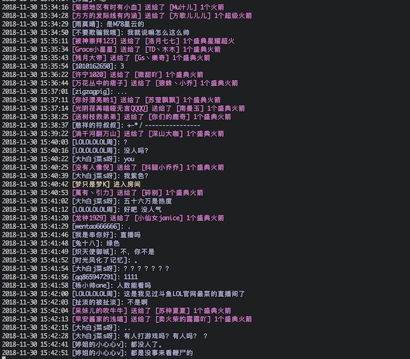

# 斗鱼弹幕 PHP版本

之前写过python获取斗鱼的弹幕 [传送门](https://github.com/wjhtime/douyu_danmu_python)，突发奇想，想要用php来实现。弹幕获取实现起来很简单，用swoole很容易做到了，后期也做了一些命令行格式的优化

使用了swoole来连接socket，取代了php的socket的函数，使用起来更加方便灵活，swoole文档 [传送门](https://wiki.swoole.com/wiki/page/1.html)

默认获取的英雄联盟的弹幕，如果想要看其他房间的弹幕，只需执行命令 php cli.php danmu <room id>即可

## Requirements
- swoole扩展
- symfony/console
- guzzlehttp/guzzle
- jaeger/querylist

## Quick Start
```
pecl install swoole
省略配置过程，具体参照swoole文档...

php cli.php danmu <room_id=288016>
或者
php danmu.php
```

## Feature
- 使用swoole获取弹幕数据
- 使用symfony/console包，内容输出更加美观
- 消息处理，弹幕消息、赠送礼物、分享房间等类型均做处理


## Screenshots


## To Do List
- 弹幕量大时出现获取数据异常


## CHANGELOG

[CHANGELOG](https://github.com/wjhtime/douyu_danmu_php/releases)


## License

[MIT](https://github.com/wjhtime/douyu_danmu_php/blob/master/LICENSE)